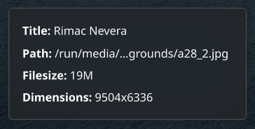

# KDE Wallpaper Info

A simple **KDE Plasma 6** widget that displays information about the current desktop wallpaper.



> Works best when used with "slideshow" or "image" wallpaper types.

## Features

- Shows the title and path of the current wallpaper
- Displays file size
- Shows image dimensions (width x height)
- Shows creation date
- Adjustable text alignment (left, center, right)
- Configurable click actions (title, path, size, dimensions, date) to perform actions like opening the image, its folder, or changing the wallpaper.
- Configurable update interval and display options

## Installation

You can download it from the KDE Store:

- Right-click on the desktop and select "Enter edit mode".
- Click "Add or manage widgets" then "Get new".
- "Download new plasma widgets" and search for "Wallpaper Info".

## Manual Installation
### Requirements

- KDE Plasma 6
- [task](https://github.com/go-task/task) (for installation)

### From Source

1. Clone this repository:
   ```
   git clone https://github.com/denizsafak/kde-wallpaper-info.git

   cd kde-wallpaper-info
   ```

2. Install the plasmoid:
   ```
   go-task install
   ```
   
   > Direct installation:
   > ```
   >kpackagetool6 -t Plasma/Applet -i .
   >```
3. Restart Plasma:
   ```
   # Quit plasmashell
   kquitapp5 plasmashell

   # Restart plasmashell
   kstart5 plasmashell
   ```

### Updating

To update an existing installation:
```
go-task update
```

### Creating a package

To create a distributable .plasmoid file:
```
go-task package
```
This will create a file in the `build` directory that can be installed using KDE's widget installer.

> [!IMPORTANT]  
> If `go-task` does not work, use `task`.

## Configuration

The widget offers several customization options, accessible by right-clicking on the widget and selecting "Configure...":

- **Update interval**: How often the widget checks for wallpaper changes (in seconds).
- **Text alignment**: Choose between left, center, or right alignment for the displayed information.
- **Widget padding**: Adjust the spacing (top, right, bottom, left) around the widget content. Includes an option to lock paddings to apply the same value to all sides.
- **Display options**:
  - **Show title**: Toggle visibility of the wallpaper title.
  - **Show path**: Toggle visibility of the wallpaper file path.
  - **Show file size**: Toggle visibility of the wallpaper file size.
  - **Show image dimensions**: Toggle visibility of the wallpaper's width and height.
  - **Show creation date**: Toggle visibility of the wallpaper's creation date.
  - **Display filename as title**: If enabled, shows the filename as the title, otherwise attempts to use metadata.
  - **Hide label prefixes**: If enabled, hides prefixes like "Title:", "Path:", etc., showing only the values.
  - **Show tooltips for long text**: If enabled, displays tooltips for text that is too long to fit.
- **Click Behavior**:
  - **Enable clickable labels**: Master switch to enable or disable all click actions on the information labels.
  - **Label Click Actions**: For each information label (Title, Path, File Size, Dimensions, Date), you can configure a specific action to be performed on click:
    - *Do nothing*: No action is performed.
    - *Open image*: Opens the current wallpaper image with the default application.
    - *Open folder*: Opens the folder containing the current wallpaper image in the file manager.

To access these settings, right-click on the widget and select "Configure..."

## How It Works

The widget uses the KDE DBus interface to query information about the current wallpaper:
```
qdbus6 org.kde.plasmashell /PlasmaShell org.kde.PlasmaShell.wallpaper 0
```

It then uses standard Linux commands to gather additional information about the file.

## Uninstallation

```
go-task remove
```
or remove it from the Plasma widgets settings.

## `Next Wallpaper` action
I couldn't find a way to trigger the `Next Wallpaper Image` action from the widget or terminal. It will be added to the widget if I find a way to do it. If you know how to trigger it, please open an issue or PR.

## Credits

I used the "[Week Number](https://github.com/nahoj/plasma6-weeknumber)" plasmoid as base, by [Anselmo L. S. Melo](https://github.com/anselmolsm)